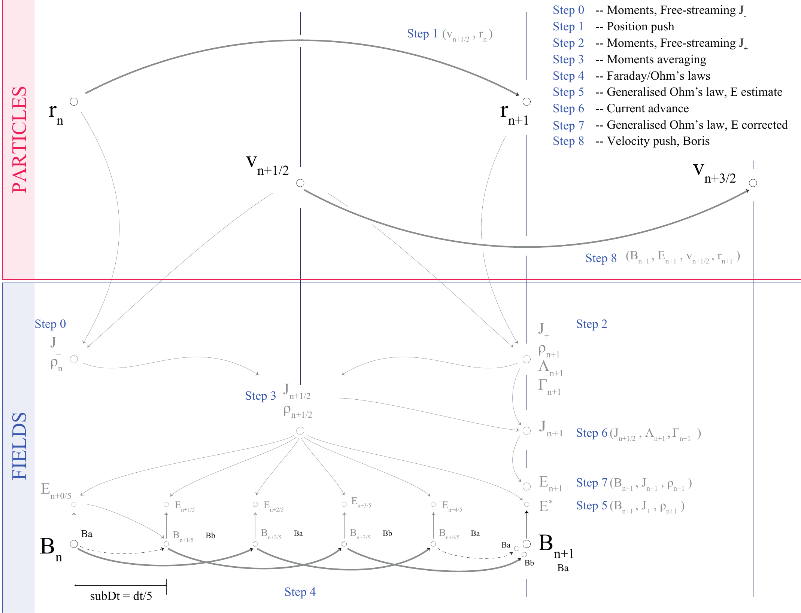
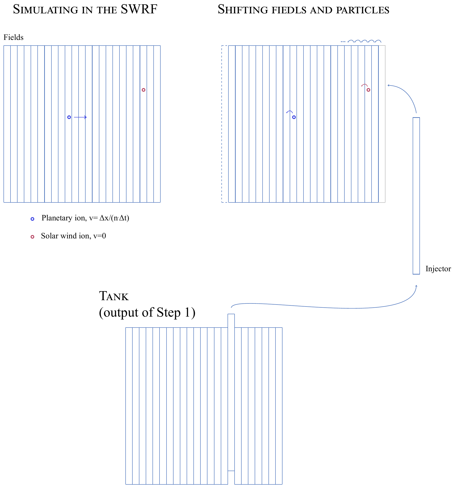

:tocdepth: 2

.. solver-label:

.. toctree::
    :maxdepth: 1

The Code Algorithms
#####################

Solver & Current Advanced Method
=================================

The solver's algorithm is shown below, with Steps indices corresponding to the
content of the main loop, within ``menura.cu``.

Reference Frame & Injection
============================

The algorithm for injecting a turbulent solar wind is illustrated below.

